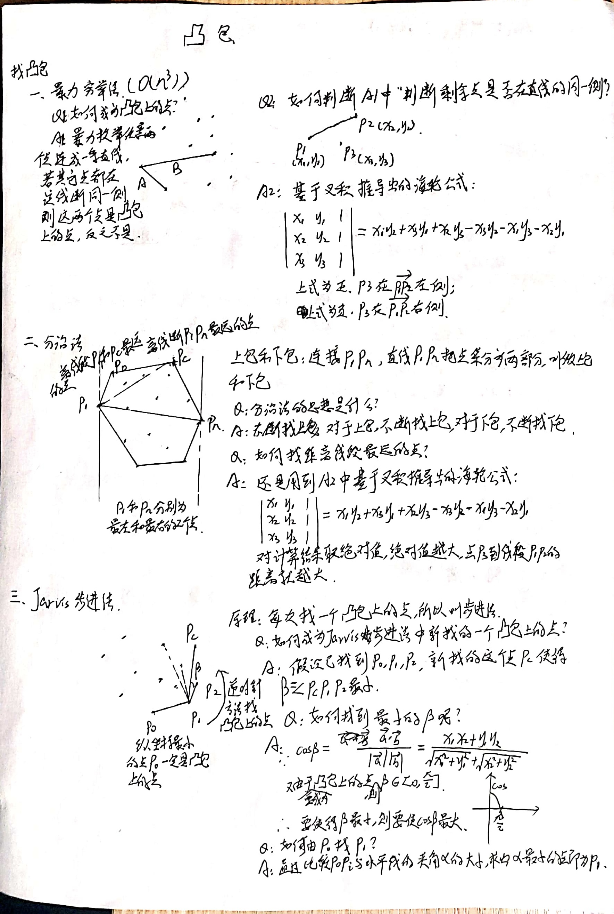

# 凸包

凸包的哲学思想是抓住主要矛盾,而忽略次要矛盾.参考资料[1]写的非常详细,学习凸包的基本算法,这个参考资料就够了.下面的笔记也是根据该资料做的.

## 参考资料

[1] [【蒟蒻计算几何】二维凸包](https://www.jvruo.com/archives/38/#morphing)

[2] [In Triangle Test / To Left Test](https://www.cnblogs.com/hyserendipity/p/12171639.html)

