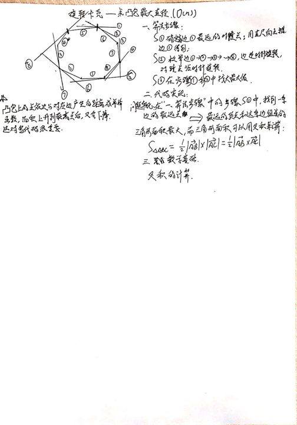

# 旋转卡壳

**说明**：参考资料[1]和[2]写的都不错，通过看这2篇博客并且通过画图就能大致理解旋转卡壳的原理了。本文学习笔记就是根据这2篇博客得到的。

**目的**：求得凸包上最远距离的2个点及其距离。

**对象**：凸包上的点。因而在进行旋转卡壳之前必须要提取轮廓的凸包。

**转化**：找到对踵点的问题→面积最大的问题→叉积最大的问题→使用行列式求叉积。

## 参考资料

[1] [【蒟蒻计算几何】旋转卡壳算法](https://www.jvruo.com/archives/79/)

[2] [旋转卡壳--求凸包最大直径](https://blog.csdn.net/u012328159/article/details/50809014)